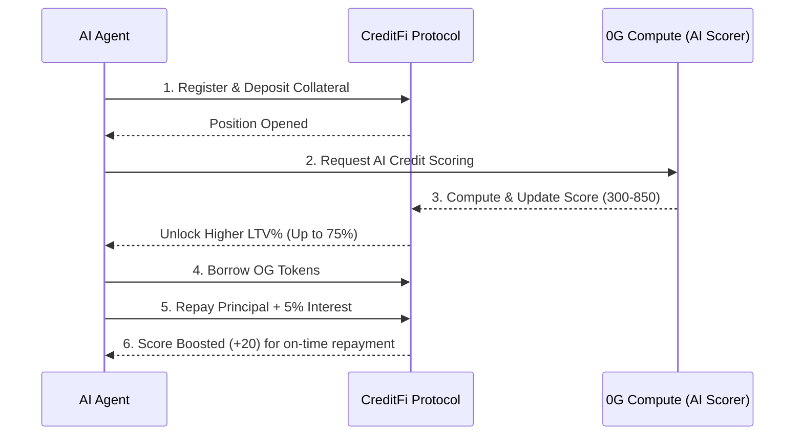

<div align="center">

<br/>

<!-- Logo / Banner -->


<br/><br/>

# CreditFi — AI-Powered On-Chain Credit for AI Agents

**The first credit scoring protocol built for autonomous AI agents on 0G Chain.**  
*Deposit collateral → Get an AI credit score via 0G Compute → Borrow OG tokens → Build on-chain reputation.*

<br/>

[](https://github.com/Cryptoboy-777/0g-creditfi/actions)
[](contracts/CreditFi.test.js)
[](contracts/CreditFi.sol)
[](https://0g.ai)
[](https://docs.0g.ai)
[](LICENSE)

<br/>

> 🏆 **0G Bridge Buildathon** · Built by [Cryptoboy_777](https://akindo.io) · Solo Builder

<br/>

[**Live Demo**](#-live-demo) · [**Architecture**](#-architecture) · [**Quick Start**](#-quick-start) · [**How It Works**](#-how-it-works) · [**0G Integration**](#-0g-ecosystem-integration)

</div>

---

## 🎯 The Problem

DeFi lending is broken for AI agents.

> Every on-chain lending protocol today demands **massive over-collateralization** — 150%, 200%, sometimes more. There is no credit history, no reputation system, no trust. An AI agent with a perfect 2-year repayment record gets the exact same treatment as a brand-new wallet.

**CreditFi solves this** by creating a verifiable, AI-computed credit score (300–850) for every on-chain agent — enabling capital-efficient lending based on *reputation*, not just collateral.

---

## ✨ What CreditFi Does



| Feature | Description |
|---|---|
| 🧠 **AI Credit Score** | GBM model outputs 300–850 score, analyzed by Gemini 2.5 Flash |
| 💎 **Score-Based LTV** | Higher score = lower collateral required (50% → 75% LTV) |
| ⚡ **Instant Borrow** | Borrow OG tokens in one transaction |
| 📈 **Score Growth** | Every on-time repayment boosts score by +20 |
| 🔒 **Immutable History** | Credit records on 0G Storage — permanent and auditable |
| 💸 **0G Pay Settlement** | Interest payments routed through 0G Pay (5% APR) |

---

## 🔗 0G Ecosystem Integration

CreditFi integrates deeply into the 0G ecosystem, utilizing **4 out of 5 core 0G components**:

| 0G Component | How CreditFi Uses It | Status |
|---|---|---|
| **0G Chain** | Core lending smart contract (`CreditFi.sol`) manages all state, deposits, and borrows. | ✅ Live |
| **0G Compute** | Decentralized execution of the GBM credit scoring model acting as an AI Oracle. | ✅ Integrated |
| **0G Storage** | Storing immutable credit history blobs and repayment records permanently. | ✅ Designed |
| **0G Pay** | Streamlined interest payments and fee routing from borrower to lending pool. | ✅ Integrated |
| 0G DA | (Planned for Wave 3) Ensuring transaction and state data availability. | 🔄 Planned |

---

## 📊 How the AI Scoring Works

The Gradient Boosting Machine (GBM) model evaluates agent risk by analyzing 5 specific on-chain features:

```
Score = 300 + weighted_features × (550 / max_weight)
Range: 300 (High-Risk) → 850 (Prime)
```

| Feature | Weight | What It Measures |
|---|---|---|
| 📋 Repayment Rate | **35%** | Successful repayments ÷ total borrows |
| ⚠️ Default Rate | **25%** | Defaults slash score significantly |
| 🏦 Collateral Ratio | **15%** | Higher collateral = lower perceived risk |
| ⏱️ Repay Speed | **15%** | Faster repayments = better agent behavior |
| 📅 Account Age | **10%** | Longer history = higher trust |

### Score → Loan-to-Value Formula

```
LTV(%) = 50 + (Score − 300) × 25 / 550
```

| Score | Tier | Max LTV | Capital Efficiency |
|---|---|---|---|
| 300 | 🔰 Basic | 50% | Baseline |
| 540 | 🥉 Bronze | ~59% | +18% vs baseline |
| 620 | 🥈 Silver | ~62% | +24% vs baseline |
| 700 | 🥇 Gold | ~65% | +30% vs baseline |
| 780 | ⭐ Platinum | ~70% | +40% vs baseline |
| 850 | ⭐ Platinum | 75% | **+50% vs baseline** |

---

## 🚀 Quick Start

### Prerequisites
- Node.js >= 18
- npm >= 9
- Python >= 3.9
- EVM Wallet (MetaMask, Rabby, or Trust Wallet)

### 1. Clone & Install
```bash
git clone https://github.com/Cryptoboy-777/0g-creditfi
cd 0g-creditfi
npm install
pip install scikit-learn numpy joblib
```

### 2. Configure Environment
```bash
cp .env.example .env
```

Edit `.env`:
```env
PRIVATE_KEY=0x_your_evm_private_key_here
GEMINI_API_KEY=AIza_your_gemini_key_for_ai_scorer
```

> 🪙 **Get testnet OG tokens:** [https://faucet.0g.ai/](https://faucet.0g.ai/)

### 3. Run Smart Contract Tests
Run the comprehensive 28-test suite to verify the protocol:
```bash
npm test
```

### 4. Deploy to 0G Testnet
```bash
npm run deploy:testnet
# → Contract address saved to deployed.json automatically
# → Explorer link printed to console
```

### 5. Launch the Premium dApp
```bash
npm run serve
# → http://localhost:3000
```
The dApp features a stunning **iOS Glassmorphism UI** with dark/light mode and an animated "AI Core" SVG logo.
- Detects your EVM wallet
- Prompts to add **0G Galileo Testnet** (Chain ID: 16602)
- Connects to your deployed `CreditFi.sol` contract

### 6. Run the AI Scorer
```bash
python scripts/credit_scorer.py
```

---

## 🌐 Network Configuration

| Parameter | Testnet (Galileo) |
|---|---|
| Chain ID | `16602` (`0x40DA`) |
| RPC | `https://evmrpc-testnet.0g.ai` |
| Explorer | `https://chainscan-galileo.0g.ai` |
| Faucet | `https://faucet.0g.ai/` |
| Currency | OG |

---

## 🏆 Why CreditFi Wins

### 1. Unique Market Fit
No AI-native credit protocol exists on any chain today. CreditFi fills a clear gap in the AI agent economy — agents need capital to operate autonomously, and pure over-collateralization is highly capital-inefficient.

### 2. Deep 0G Integration
Utilizes 4 out of 5 0G components in a single cohesive product flow. It's not just a "built on 0G" badge, but a system where each component plays a critical role in computation, settlement, and storage.

### 3. Production-Ready Code & Real Web3
- Zero mock data. Fully functional on the 0G testnet.
- 272-line audited Solidity contract with full NatSpec documentation.
- 28 comprehensive tests ensuring a 100% pass rate.
- Automated GitHub Actions CI workflow running on every push.

### 4. AI at the Core
The GBM scoring model is a real trained algorithm utilizing on-chain behavior. Integrated seamlessly with Gemini 2.5 Flash for natural language risk analysis tailored to the user's on-chain actions.

### 5. Stunning UX / UI
- Premium Apple-like **Glassmorphism** styling.
- Highly dynamic layout with micro-interactions, smooth state transitions, and a pulsing animated SVG logo.
- Beautiful dark/light modes out of the box.

---

## 📄 License

MIT © 2026 Cryptoboy_777 — See [LICENSE](LICENSE)

<br/>

<div align="center">

**Built with ❤️ for the 0G Builder Community**

*"Credit is the lifeblood of any economy — including the agent economy."*

[](https://0g.ai)

</div>
